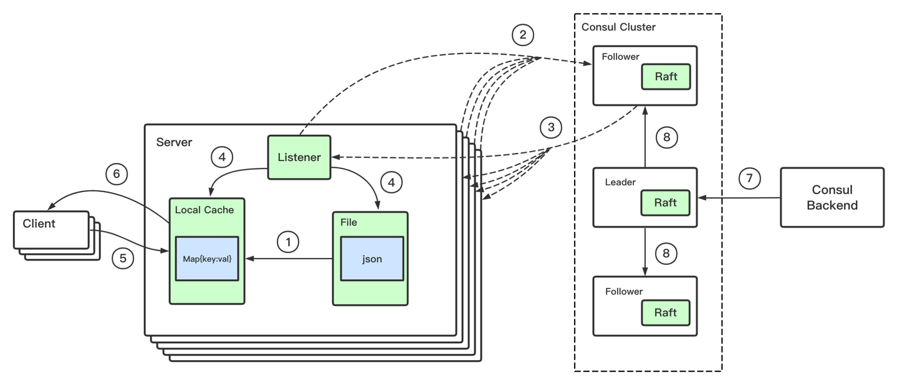
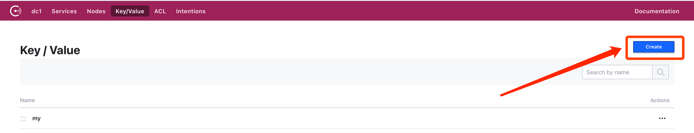
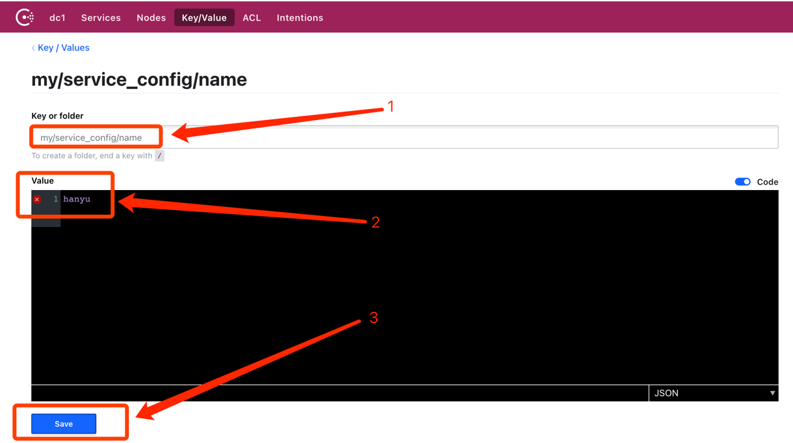

# 统一配置中心(基于Consul)

## 架构



````
1. 服务初始化的时候，加载本地的配置文件到内存中
2.  consul listener初始化，阻塞查询(blocking query)直到3的到来
3. 有数据变更，或者设置超时时间到了，返回数据，通知各个客户端更新数据
4.  listener合并内存中的数据和3返回的数据，然后写入内存和配置文件
5. 客户端请求我们的服务，然后读取本地内存、业务处理
6. 服务端返回数据给客户端
7. 管理员变更配置(CRUD)
8 . consul leade「通过raft一致性算法写入follower
````
## 使用
1. 下载代码之后运行consul
   命令：./consul agent -dev
2. 在浏览器中输入 http://127.0.0.1:8500/ui/dc1/kv, 创建 my/service_config/name
   
   
3. 启动服务，当consul上的key变化时，会回调我们初始化的listener，同步到本机内存。项目中的
使用方式\
   ````v := config.GetStringOrElse("name", "default")````
   

## CAP
````
AP
````
